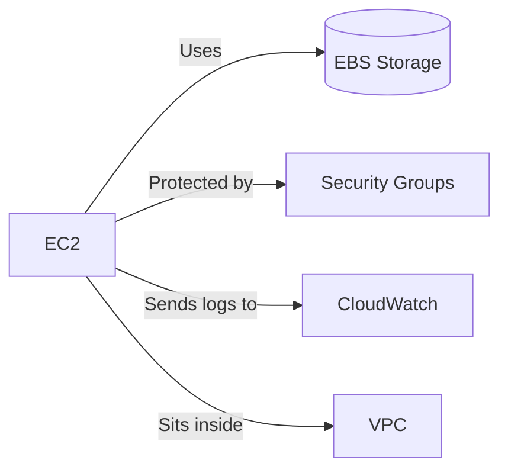

# Amazon EC2: Your Virtual Computer in the Cloud ☁️💻

  
  <h3>Your Virtual Servers in the Cloud</h3>
  <h3>(Imagine EC2 as renting a computer that lives on the internet instead of your desk)</h3>

## 🌟 What is EC2?
EC2 (Elastic Compute Cloud) lets you rent virtual computers in Amazon's data centers. It's like borrowing a powerful laptop from Amazon that:
- You can turn on/off anytime
- Comes in 400+ different sizes
- Only pay for what you use

## 🔑 Key Features
| Feature | Why It Matters |
|---------|---------------|
| **Scalability** | Need more power? Upgrade your "virtual computer" with 1 click |
| **Pay-as-you-go** | Only pay while it's running (like a taxi meter) |
| **Pre-configured options** | Choose from 100+ ready-to-use software setups |
| **Global availability** | Run your computer in any of AWS's 30+ locations worldwide |

## 🏆 Why People Use EC2
- **Host websites** (Like Netflix's recommendation engine)
- **Run apps** (Mobile game backends)
- **Process data** (Analyze millions of sales records)
- **Test software** (Safe environment to try new code)

## 🕰️ When to Choose EC2?
✅ **Best for**:
- Projects needing full control over the computer
- Running software that doesn't fit serverless limits
- Predictable workloads (e.g., always-on databases)

❌ **Not ideal for**:
- Tiny tasks (use [Lambda](../AWS%20Lambda/README.md) instead)
- Simple file storage (use [S3](../Amazon%20S3/README.md))

## 🧑‍💻 Basic

## ⚠️ Watch Out For...
- **Stopped ≠ Terminated**:  
- Stopped instances don't run but still cost for storage  
- Terminated instances are deleted permanently  
- **Public IPs Change**: Your instance's public IP resets after restart (use [Elastic IPs](Elastic_IPs.md) for fixed addresses)  
- **Data Loss**: Anything saved locally disappears if terminated (always use [EBS](../Amazon%20EBS/README.md) for important files)  

## 🤔 EC2 vs Other Options
| Need | Better Choice | Why |
|-------|---------------|-----|
| Run code occasionally | Lambda | No servers to manage |
| Host simple website | S3 Static Hosting | Cheaper & simpler |
| Run containers | ECS/EKS | Better for microservices |

## 🚀 Where to Go From Here
Check the repository. 
